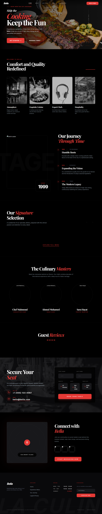
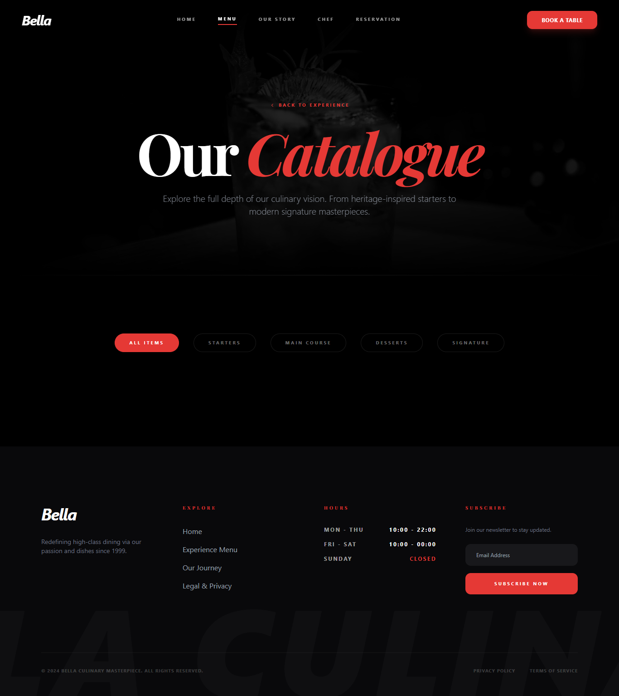
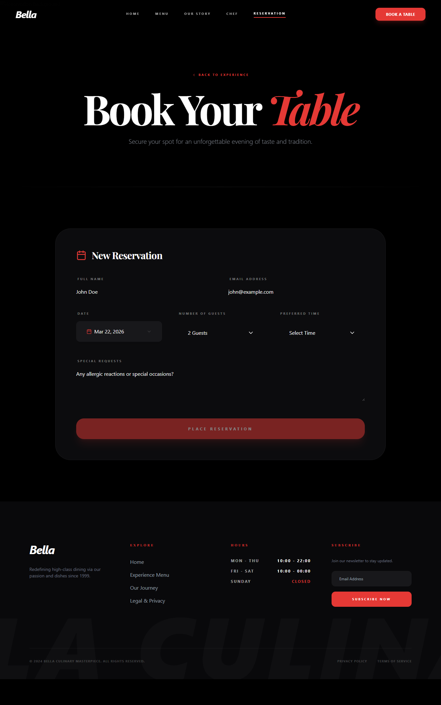
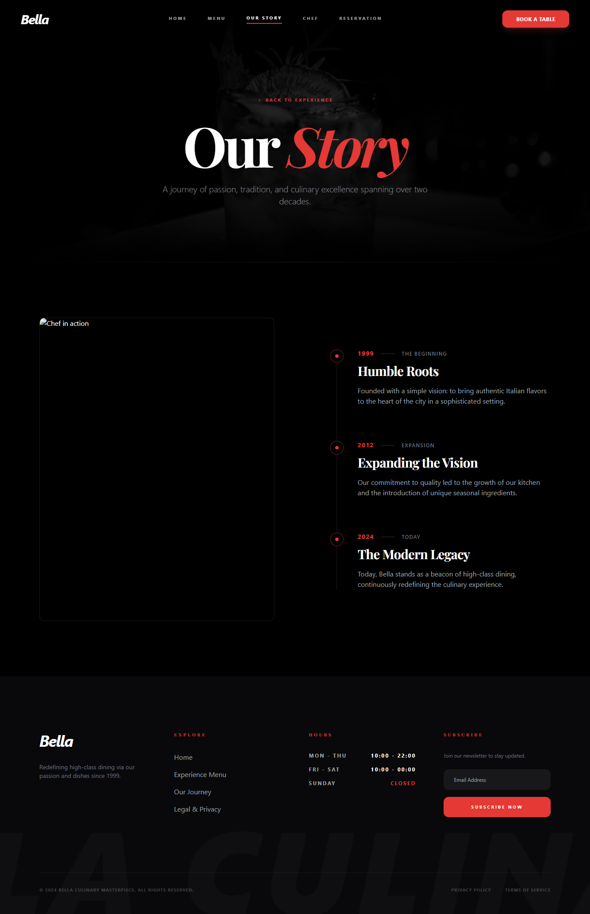

# Bella

> A refined digital front door for a modern restaurant.

Bella is an Angular 19 restaurant experience focused on the details that make a dining brand feel premium: editorial typography, warm visual rhythm, responsive interactions, and a clear path from discovery to reservation.

[Live site](https://bella-flax.vercel.app/) · [Get started](docs/PROJECT_SETUP.md) · [Documentation](docs/INDEX.md)



## Experience focus

- **Modern editorial UI** — a layered, responsive visual system for the restaurant story, chef profiles, menu, and booking moments.
- **Conversion-first journeys** — direct navigation from inspiration to menu exploration and table reservation.
- **Maintainable Angular architecture** — standalone components organized into `core`, `features`, `layout`, and `shared` boundaries.
- **Predictable data flow** — NgRx state and a mock API keep restaurant content easy to evolve into a production backend.
- **Quality by default** — TypeScript, ESLint, Prettier, unit tests, Lighthouse, and GitHub Actions support a dependable delivery workflow.

## Preview

| Menu | Reservations | Restaurant story |
| --- | --- | --- |
|  |  |  |

## Start locally

**Prerequisites:** Node.js 20 LTS and npm.

```bash
git clone https://github.com/zakriahossam212-blip/Restaurant-Bella-F.git
cd Restaurant-Bella-F
npm ci
npm start
```

Open <http://localhost:4200>.

## Everyday commands

```bash
npm start                 # Local development server
npm run build:prod        # Optimized production build
npm run type-check        # Application TypeScript check
npm run lint              # ESLint
npm run format:check      # Prettier validation
npm run test:ci           # Headless unit tests with coverage
```

## Project map

```text
src/app/
├── core/       # API configuration, models, and NgRx state
├── features/   # Route-level restaurant experiences
├── layout/     # Shared navigation and footer
└── shared/     # Reusable UI such as the premium calendar

public/
├── assets/     # Static brand and chef imagery
└── data/       # Mock restaurant data

docs/          # Focused product, engineering, and operations guides
config/        # Deployment and quality-tool configuration
```

## Documentation

| Need | Read |
| --- | --- |
| Install, run, test, and troubleshoot | [Project setup](docs/PROJECT_SETUP.md) |
| Understand application boundaries and state | [Architecture](docs/architecture.md) |
| Work with the visual system | [Style guide](docs/STYLES.md) |
| Review delivered product capabilities | [Features](docs/FEATURES.md) |
| Deploy and operate the app | [Deployment](docs/DEPLOYMENT.md) |
| Contribute safely | [Contributing](docs/CONTRIBUTING.md) · [Security](docs/SECURITY.md) · [Code of conduct](docs/CONDUCT.md) |
| Browse all maintained docs | [Documentation index](docs/INDEX.md) |

## Contributing

Before opening a pull request, run the checks relevant to your change and update the focused documentation above when behavior changes. See the [contribution guide](docs/CONTRIBUTING.md) for branch, commit, testing, and review conventions.
